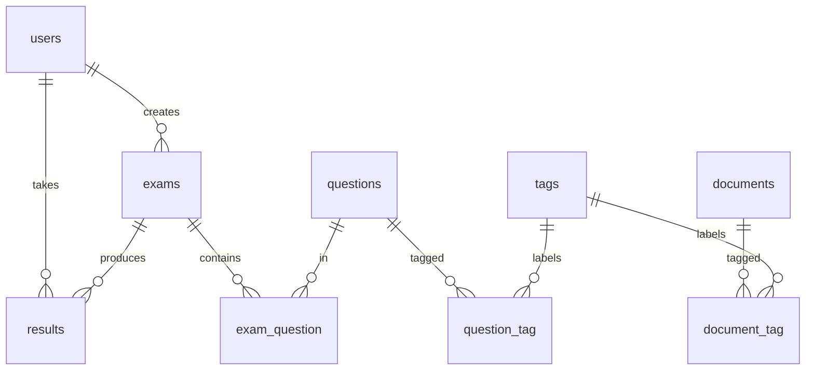

# Database

PostgreSQL schema for **study-physic-by-test**.

## Files

| File | Purpose |
| --- | --- |
| `schema.sql` | Full DDL — tables, foreign keys, unique constraints, indexes. |
| `seed.sql` | Sample data (users, tags, questions, documents and their links). |
| `ERD.mermaid` | Entity-relationship diagram (renders in any Mermaid viewer / GitHub). |

## Runtime source of truth

At runtime the schema is built by **Sequelize migrations**, not by `schema.sql`:

```bash
npm run db:migrate     # create/upgrade tables
npm run db:seed        # insert demo users
npm run db:seed:sql    # insert demo tags/questions/documents (via psql, idempotent)
npm run db:reset       # undo all, migrate, then seed
```

`schema.sql` mirrors those migrations and additionally declares the foreign
keys and indexes that the model associations rely on. Use it for manual
bootstrapping, code review, or spinning up a database without the Node toolchain:

```bash
psql "$DATABASE_URL" -f database/schema.sql
psql "$DATABASE_URL" -f database/seed.sql
```

Or, against the Docker Postgres container: `npm run db:seed:sql` (root or back-end),
which runs `docker exec -i physic-test-postgres psql ... -f - < database/seed.sql`.

## Demo accounts

All seeded accounts use the password **`123456`**.

| Email | Role |
| --- | --- |
| `admin@test.com` | admin |
| `student@test.com` | user |
| `test0@test.com` | user |
| `test1@test.com` | user |
| `test2@test.com` | user |

## Known gap

The `create_users_table` migration does not declare `email` as `UNIQUE`, even though
this file's `schema.sql` does (`users_email_unique`). Not fixed here — follow-up migration.

## Schema overview

- **users** — accounts; `role` drives admin vs. user access.
- **questions** — question bank; `answer` is JSONB, `mainTag` groups by topic, `averateTime`/`totalUser` track a rolling average answer time.
- **tags** — topic labels (M:N with both questions and documents).
- **documents** — study material (M:N with tags).
- **exams** — a generated test owned by a user.
- **results** — a user's score for an exam.
- **exam_question / question_tag / document_tag** — M:N join tables.


